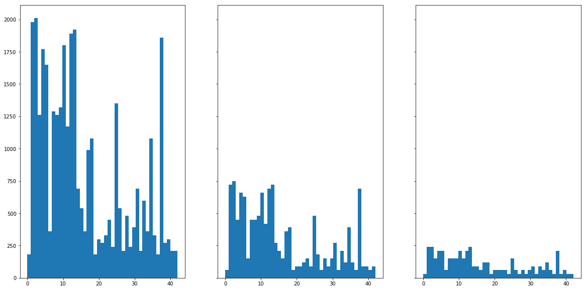
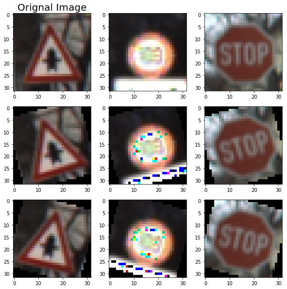
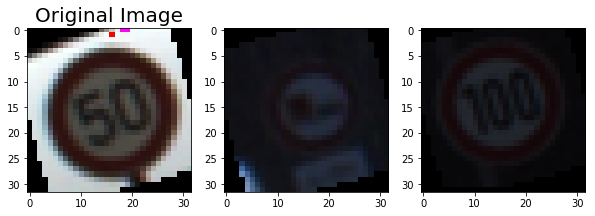
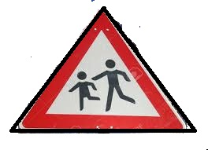
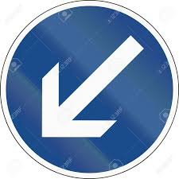
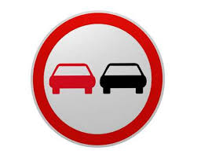
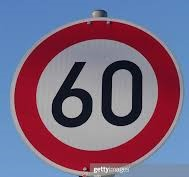
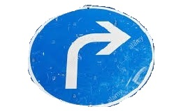
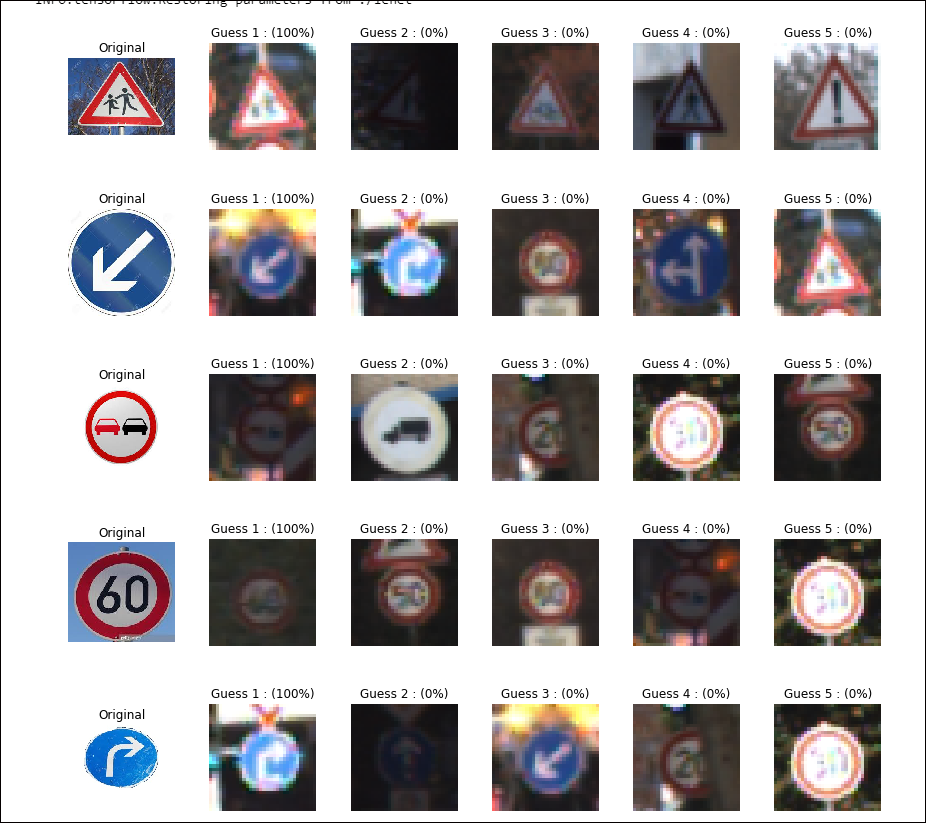

# **Traffic Sign Recognition** 

## Writeup

## **Build a Traffic Sign Recognition Project**

The goals / steps of this project are the following:
* Load the data set (see below for links to the project data set)
* Explore, summarize and visualize the data set
* Design, train and test a model architecture
* Use the model to make predictions on new images
* Analyze the softmax probabilities of the new images
* Summarize the results with a written report

## Rubric Points
### Here I will consider the [rubric points](https://review.udacity.com/#!/rubrics/481/view) individually and describe how I addressed each point in my implementation.  

---
### Writeup / README

#### 1. Provide a Writeup / README that includes all the rubric points and how you addressed each one. You can submit your writeup as markdown or pdf. You can use this template as a guide for writing the report. The submission includes the project code.

You're reading it! 

### Data Set Summary & Exploration

#### 1. Provide a basic summary of the data set. In the code, the analysis should be done using python, numpy and/or pandas methods rather than hardcoding results manually.

I used the numpy library to calculate summary statistics of the traffic
signs data set:

* The size of training set is  34799 
* The size of the validation set is 4410 
* The size of test set is 12630
* The shape of a traffic sign image is (32, 32, 3)
* The number of unique classes/labels in the data set is 43

#### 2. Include an exploratory visualization of the dataset.

Here is an exploratory visualization of the data set. It is a bar chart showing how the data is 

### Design and Test a Model Architecture

#### 1. Describe how you preprocessed the image data. What techniques were chosen and why did you choose these techniques? Consider including images showing the output of each preprocessing technique. Pre-processing refers to techniques such as converting to grayscale, normalization, etc. (OPTIONAL: As described in the "Stand Out Suggestions" part of the rubric, if you generated additional data for training, describe why you decided to generate additional data, how you generated the data, and provide example images of the additional data. Then describe the characteristics of the augmented training set like number of images in the set, number of images for each class, etc.)

As a first step, I decided to convert the images to grayscale as suggested in the class. As I was proceeding with the project , I found out significant improvement with rgb images than greyscale though there is a penalty to be paid for processing.

I then went ahead with normalization to speed up the training process by making the gradient decent converge quicker

I decided to generate additional data because because in real world the signs can be under different lighting conditions or at different angles.

To add more data to the the data set, I used rotation clockwise, counter-clockwise and warping the images.

Here is an example of an original image and 30 degrees rotated images:

Here are a few images with warping applied

The final datasize with augmentation came to 104397.

I have even coded for brightness changes and sharpening and did not use it since the previous two augmentation techniques were sufficient.

#### 2. Describe what your final model architecture looks like including model type, layers, layer sizes, connectivity, etc.) Consider including a diagram and/or table describing the final model.

My final model consisted of the following layers:

| Layer         		|     Description	        					|
|:---------------------:|:---------------------------------------------:|
| Input         		| 32x32x3 RGB image   							|
| Convolution 5x5    | 1x1 stride, Valid padding, outputs 28x28x3 |
| Activation | Relu |
| Max pooling	      	| 2x2 stride,  outputs 14x14x6 		|
| Convolution 5x5	  | 1x1 stride, Valid padding, outputs 10x10x6 |
| Activation	| Relu |
| Max pooling	| 2x2 stride,  outputs 5x5x16 |
| Flatten	| output 400 |
| Fully connected		| input 400, output 120 |
| Activation	| Relu |
| Fully connected	| input 120, output 84 |
| Activation	| Relu |
| Fully connected	| input 84, output 43 |

#### 3. Describe how you trained your model. The discussion can include the type of optimizer, the batch size, number of epochs and any hyperparameters such as learning rate.

The model as seen above is built over the lenet architecture discussed in the class. To train the model, I used an adams optimizer with a learning rate of 0.001, epoch size of 25 and a batch size of 129. These values were chosen after a lot of tweaking around. When the validation accuracy reached 95%, I stopped further changes and moved on. Extra data and augmentation was definitely necessary to reach this accuracy.

#### 4. Describe the approach taken for finding a solution and getting the validation set accuracy to be at least 0.93. Include in the discussion the results on the training, validation and test sets and where in the code these were calculated. Your approach may have been an iterative process, in which case, outline the steps you took to get to the final solution and why you chose those steps. Perhaps your solution involved an already well known implementation or architecture. In this case, discuss why you think the architecture is suitable for the current problem.

My final model results were:
* training set accuracy of 99%
* validation set accuracy of 95% 
* test set accuracy of 93.5%

If an iterative approach was chosen:
* What was the first architecture that was tried and why was it chosen?
  * First I selected the lenet as described in the class as is.
* What were some problems with the initial architecture?
  * Even with multiple data augmentations the validation accuracy wasnt approaching 93%. I wanted to better it
* How was the architecture adjusted and why was it adjusted? Typical adjustments could include choosing a different model architecture, adding or taking away layers (pooling, dropout, convolution, etc), using an activation function or changing the activation function. One common justification for adjusting an architecture would be due to overfitting or underfitting. A high accuracy on the training set but low accuracy on the validation set indicates over fitting; a low accuracy on both sets indicates under fitting.
  * I increased the depth of the neural net by adding more convolutions. While this was an experimentation phase, I saw that this step helped improve the accuracy. My guess it is able to extract more features out of the images.
* Which parameters were tuned? How were they adjusted and why?
  * epochs, learning rate, batch sizes were tuned to improve the training. The havent changed the dropout probabilities since I havent observed overfitting issues. I started the learning rate at 0.01 and decreased all the way to 0.001. It did improve the training. The biggest improvement came with the data augmentation. I could have added more augmentation like the sharpening and brightness I described earlier. I will do that for my own understanding later.
* What are some of the important design choices and why were they chosen? For example, why might a convolution layer work well with this problem? How might a dropout layer help with creating a successful model?
  * I think since there are a lot of features in the images, a convolution layer works well here. The dropout layer surely helps with overfitting issues. I observed one phenomenon where the pole which is connected to the traffic sign was showing up a feature. These types of issues can be solved with the dropout layers. Normalization of the data also helped with the accuracy and speed of training. 

### Test a Model on New Images

#### 1. Choose five German traffic signs found on the web and provide them in the report. For each image, discuss what quality or qualities might be difficult to classify.

Here are five German traffic signs that I found on the web:

They are all different sizes and I chose the first one a little more difficult to detect than the others. Also they have varying backgrounds which should test the accuracy.

#### 2. Discuss the model's predictions on these new traffic signs and compare the results to predicting on the test set. At a minimum, discuss what the predictions were, the accuracy on these new predictions, and compare the accuracy to the accuracy on the test set (OPTIONAL: Discuss the results in more detail as described in the "Stand Out Suggestions" part of the rubric).

Here are the results of the prediction:

| Image			        |     Prediction	        					|
|:---------------------:|:---------------------------------------------:|
| Children Crossing | Children Crossing |
| Keep Left | Keep Left 	|
| No Passing	| No Passing	|
| 60 Kmph	  | 60 Kmph			|
| Turn right ahead	| Turn right ahead |

The model was able to correctly guess 5 of the 5 traffic signs, which gives an accuracy of 100%. This compares favorably to the accuracy on the test set of 93.5%. I did observe the 60Mph sign interpreted as 50 sometimes. 

#### 3. Describe how certain the model is when predicting on each of the five new images by looking at the softmax probabilities for each prediction. Provide the top 5 softmax probabilities for each image along with the sign type of each probability. (OPTIONAL: as described in the "Stand Out Suggestions" part of the rubric, visualizations can also be provided such as bar charts)

The code for making predictions on my final model is last cell of the Ipython notebook.

Here are the final guesses with the softmax probabilities printed. 

